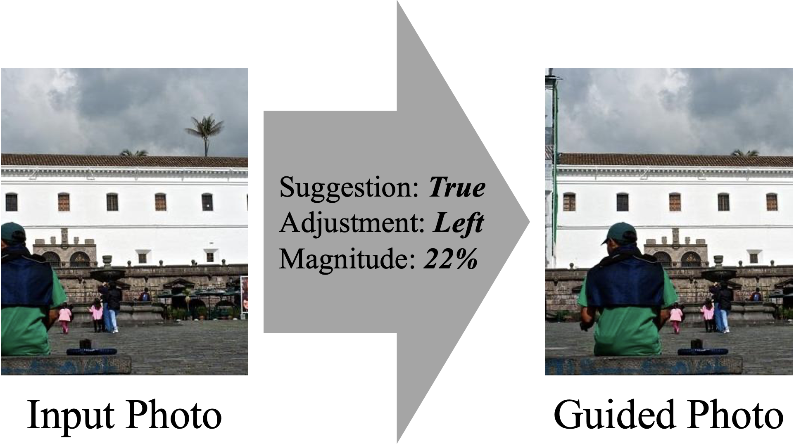

# VAPNet-Pytorch

This is an unofficial Pytorch implementation of **View Adjustment Prediction Model** in [Camera View Adjustment Prediction for Improving Image Composition(2021)](https://arxiv.org/abs/2104.07608).

# View Adjustment Prediction Model

View Adjustment Prediction Model, which we named as **VAPNet**, predicts whether an image needs adjustment, which adjustment, and how much adjustment is needed.

# Performance

|                | **AUC** | **TPR** | **Left** | **Right** | **Up** | **Down** | **Zoom-in** | **Zoom-out** | **Clockwise** | **Counter-Clockwise** | **IoU** |
| :------------: | :-----: | :-----: | :------: | :-------: | :----: | :------: | :---------: | :----------: | :-----------: | :-------------------: | :-----: |
| Original Paper |  0.608  |  0.436  |  0.221   |   0.221   | 0.390  |  0.341   |    0.015    |    0.378     |     0.124     |         0.110         |  0.750  |
|    Version1    |  0.624  |  0.483  |  0.263   |   0.240   | 0.332  |  0.295   |    0.015    |    0.061     |     0.152     |         0.144         |  0.750  |
|    Version2    |  0.627  |  0.485  |  0.324   |   0.300   | 0.494  |  0.512   |    None     |     None     |     None      |         None          |  0.759  |

- Columns from `Left` to `Counter-Clockwise` means F1-Score

# Dataset

- GAICD [[Paper](https://arxiv.org/abs/1904.04441)][[Github](https://github.com/HuiZeng/Grid-Anchor-based-Image-Cropping)]
- FCDB [[Paper](https://arxiv.org/abs/1701.01480)][[Github](https://github.com/yiling-chen/flickr-cropping-dataset)]
- Open Images[[Homepage](https://storage.googleapis.com/openimages/web/index.html)][[CVDF](https://github.com/cvdfoundation/open-images-dataset#download-images-with-bounding-boxes-annotations)]

# Usage
```bash
git clone https://github.com/PROLCY/VAPNet-Pytorch.git
cd VAPNet-Pytorch && mkdir weight
```
```bash
pip install -r requirements.txt
```
## Demo

Download pretrained model in the directory `weight`

|          |                               Adjustment                               |  IoU  |                                         **Download**                                         |
| :------: | :--------------------------------------------------------------------: | :---: | :------------------------------------------------------------------------------------------: |
| Version1 | Left, Right, Up, Down, Zoom-in, Zoom-out, Clockwise, Counter-Clockwise | 0.750 | [Link](https://drive.google.com/drive/folders/1NwybSAw_tlC4Nb5l8bI381UU7_PAXUpL?usp=sharing) |
| Version2 |                         Left, Right, Up, Down                          | 0.759 | [Link](https://drive.google.com/drive/folders/1DdI_0AEC4fiJ4urIiH5010pZft4I2rdy?usp=sharing) |

```bash
python demo.py {image_dir_path}
```

You can check the inference result in terminal.

## Result
**Predicted view adjustment is as follows.**


**If you are interested in this repository, please contact `ckd248@naver.com`**
